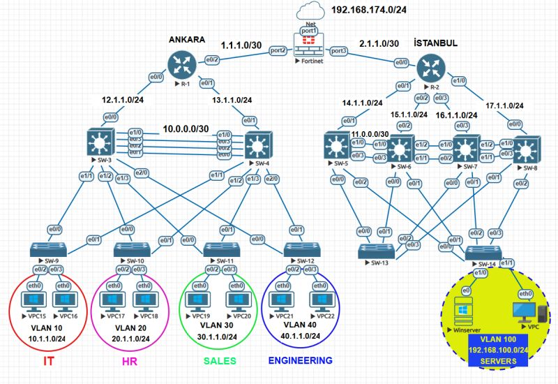

<<<<<<< HEAD
# Enterprise Network & FortiGate Lab

A multi-site enterprise network lab built in **EVE-NG**. The topology demonstrates Cisco routing/switching, VLAN segmentation, OSPF-ready routed links, FortiGate NGFW edge security, and Windows Server services.

> This repository uses sanitized lab documentation. No real production IPs, passwords, VPN keys, or organization-specific data are included.

## Lab Topology



## Main Technologies

- Cisco routing and switching
- FortiGate NGFW edge firewall
- VLAN segmentation
- Inter-VLAN routing
- Routed L3 links
- DHCP Relay / IP Helper concept
- Windows Server services
- Enterprise network documentation

## Correct VLAN and IP Plan

### Ankara Site

| Segment | VLAN | Subnet | Purpose |
|---|---:|---|---|
| IT | 10 | `10.1.1.0/24` | IT users |
| HR | 20 | `20.1.1.0/24` | Human Resources users |
| Sales | 30 | `30.1.1.0/24` | Sales users |
| Engineering | 40 | `40.1.1.0/24` | Engineering users |

### Istanbul Site

| Segment | VLAN | Subnet | Purpose |
|---|---:|---|---|
| Servers | 100 | `192.168.100.0/24` | Windows Server and server-side test clients |

### Routed / Transit Networks

| Link | Subnet |
|---|---|
| Ankara R1 ↔ FortiGate | `1.1.1.0/30` |
| FortiGate ↔ Istanbul R2 | `2.1.1.0/30` |
| FortiGate WAN / Internet-side lab network | `192.168.174.0/24` |
| Ankara R1 ↔ SW-3 | `12.1.1.0/24` |
| Ankara R1 ↔ SW-4 | `13.1.1.0/24` |
| SW-3 ↔ SW-4 routed link | `10.0.0.0/30` |
| Istanbul R2 ↔ SW-5 | `14.1.1.0/24` |
| Istanbul R2 ↔ SW-6 | `15.1.1.0/24` |
| Istanbul R2 ↔ SW-7 | `16.1.1.0/24` |
| Istanbul R2 ↔ SW-8 | `17.1.1.0/24` |
| SW-5 ↔ SW-6 routed link | `11.0.0.0/30` |
=======
# Enterprise Network & FortiGate Security Lab


## Overview

This repository documents a multi-site enterprise network lab built on **EVE-NG**.  
The project simulates an end-to-end infrastructure with **HQ and Branch locations**, Cisco switching/routing, FortiGate NGFW integration, centralized services and identity management.

The goal of this lab is to demonstrate how enterprise network components work together across:

- Core & Distribution switching
- Layer 2 redundancy
- Dynamic routing
- Inter-VLAN routing
- FortiGate edge security
- NAT and firewall policies
- Hub-and-spoke WAN design
- Windows Server Active Directory
- DHCP Relay for multi-VLAN clients

> This is a sanitized lab project. No real organization IP addresses, credentials, firewall exports, production topology data or sensitive information are included.

---

## Architecture Summary

| Layer | Technologies | Purpose |
|---|---|---|
| Core & Distribution | Cisco Switching, HSRP, EtherChannel, VTP | Redundant and optimized LAN architecture |
| Routing | OSPF, Inter-VLAN Routing | Internal dynamic routing and VLAN gateway design |
| Security & WAN | FortiGate NGFW, NAT, Firewall Policies | Edge routing, traffic inspection and secure segmentation |
| Branch Connectivity | Hub-and-Spoke Design | Centralized traffic flow from branch locations |
| Identity & Services | Windows Server, Active Directory, DHCP Relay | Centralized identity and IP address assignment |

---

## Logical Topology


```

---

## Key Features

### Cisco Core & Distribution

- VLAN-based segmentation
- HSRP gateway redundancy
- EtherChannel for link aggregation
- VTP for VLAN propagation in lab environment
- OSPF for dynamic internal routing
- Inter-VLAN routing for user and service networks

### FortiGate Security & WAN

- FortiGate moved edge routing and NAT responsibilities from router layer to NGFW layer
- Hub-and-spoke WAN architecture
- Service-based and direction-based firewall policy design
- Centralized traffic control
- NAT policy separation
- Secure branch-to-HQ connectivity model

### Microsoft Services

- Windows Server deployed in the data center segment
- Active Directory used for identity management
- DNS service integration
- Central DHCP design
- DHCP Relay configured for IT, HR and Sales VLANs

---

## Example Addressing Plan

| Segment | VLAN | Subnet | Gateway |
|---|---:|---|---|
| IT | 10 | 10.10.10.0/24 | 10.10.10.1 |
| HR | 20 | 10.10.20.0/24 | 10.10.20.1 |
| Sales | 30 | 10.10.30.0/24 | 10.10.30.1 |
| Servers | 40 | 10.10.40.0/24 | 10.10.40.1 |
| Management | 99 | 10.10.99.0/24 | 10.10.99.1 |
| Ankara Branch | 110 | 10.20.10.0/24 | 10.20.10.1 |
| Istanbul Branch | 120 | 10.30.10.0/24 | 10.30.10.1 |

---
>>>>>>> 3e93d57fe7003addf57d61508e7861286b2cbf96

## Repository Structure

```text
<<<<<<< HEAD
.
├── README.md
├── docs/
│   ├── addressing-plan.md
│   ├── architecture.md
│   ├── implementation-steps.md
│   ├── troubleshooting.md
│   └── lessons-learned.md
├── diagrams/
│   ├── topology.png
│   └── topology.mmd
├── configs/
│   ├── cisco/
│   │   ├── r1-ankara-sample.cfg
│   │   ├── r2-istanbul-sample.cfg
│   │   ├── sw3-ankara-distribution-sample.cfg
│   │   ├── sw4-ankara-distribution-sample.cfg
│   │   └── sw14-server-access-sample.cfg
│   ├── fortigate/
│   │   ├── fortigate-edge-sample.conf
│   │   └── firewall-policy-matrix.md
│   └── windows-server/
│       └── dhcp-scope-plan.md
└── checklists/
=======
enterprise-network-fortigate-lab/
├── README.md
├── LICENSE
├── .gitignore
├── SECURITY.md
├── docs/
│   ├── architecture.md
│   ├── addressing-plan.md
│   ├── implementation-steps.md
│   ├── troubleshooting.md
│   └── lessons-learned.md
├── configs/
│   ├── cisco/
│   │   ├── core-sw1-sample.cfg
│   │   ├── core-sw2-sample.cfg
│   │   └── branch-switch-sample.cfg
│   ├── fortigate/
│   │   ├── fortigate-hq-sample.conf
│   │   └── firewall-policy-matrix.md
│   └── windows-server/
│       └── dhcp-relay-and-ad-notes.md
├── diagrams/
│   ├── topology.mmd
│   └── topology-notes.md
└── checklists/
    ├── pre-deployment-checklist.md
>>>>>>> 3e93d57fe7003addf57d61508e7861286b2cbf96
    ├── validation-checklist.md
    └── security-hardening-checklist.md
```

<<<<<<< HEAD
## Suggested GitHub Topics

`eveng` `cisco` `fortigate` `network-security` `enterprise-network` `vlan` `ospf` `dhcp-relay` `windows-server` `firewall` `network-engineering`

## Notes

This lab is designed as a technical portfolio project. It focuses on network design, documentation quality, and troubleshooting methodology rather than exposing any production configuration.
=======
---

## Configuration Samples

Configuration examples are intentionally simplified and sanitized.  
They are designed to show the design logic, not to expose production-ready secrets or real infrastructure data.

See:

- [`configs/cisco/core-sw1-sample.cfg`](configs/cisco/core-sw1-sample.cfg)
- [`configs/cisco/core-sw2-sample.cfg`](configs/cisco/core-sw2-sample.cfg)
- [`configs/fortigate/fortigate-hq-sample.conf`](configs/fortigate/fortigate-hq-sample.conf)
- [`configs/fortigate/firewall-policy-matrix.md`](configs/fortigate/firewall-policy-matrix.md)
- [`configs/windows-server/dhcp-relay-and-ad-notes.md`](configs/windows-server/dhcp-relay-and-ad-notes.md)

---

## Validation Checklist

- [ ] VLANs created and assigned correctly
- [ ] Trunk links operational
- [ ] EtherChannel bundles up
- [ ] HSRP active/standby status verified
- [ ] OSPF neighbor relationships established
- [ ] Inter-VLAN routing works
- [ ] FortiGate NAT policies verified
- [ ] Firewall policies allow only required traffic
- [ ] DHCP Relay assigns IP addresses to all VLANs
- [ ] Domain clients resolve DNS and reach domain controller
- [ ] Branch users reach allowed HQ services
- [ ] Unauthorized inter-VLAN traffic blocked

---

## Lab Notes

This lab is suitable for:

- CCNA / CCNP Enterprise practice
- FortiGate security policy design practice
- Windows Server and AD integration practice
- Enterprise network documentation portfolio
- GitHub technical portfolio improvement

---

## Disclaimer

This project is for educational and portfolio purposes only.  
All IP ranges, hostnames, policies and configurations are fictional or sanitized lab examples.

>>>>>>> 3e93d57fe7003addf57d61508e7861286b2cbf96
